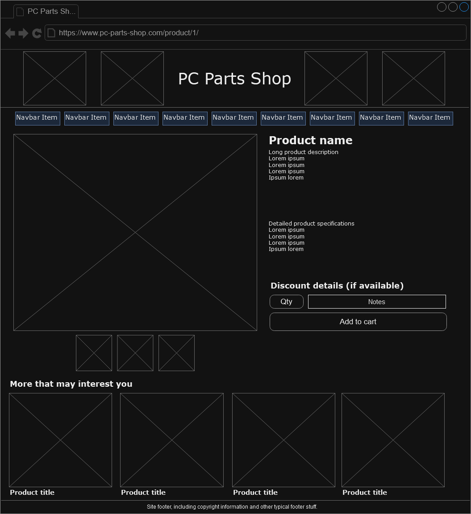

# PC-Parts-Shop-Mod10
 
This is the repository for PC Parts Shop, the online store for all your computer hardware needs.

This store sells prebuilt systems such as PCs and laptops, but also sells individual components such as processors, motherboards, and graphics cards.

The main goal of the store is to make it easy to buy and/or build the best system you can in your chosen price range with minimal effort. It might be thought of as a more targeted version of a site like Newegg, with a strong focus on value. One of the key features is a section which automatically selects parts for a build based on a given price. For those who prefer to peruse, search and filter options would also be provided so they can more effectively find what they are looking for.

In short, PC Parts Shop is a value-focused computer store that enables people to get the best performance they can with the budget they have available.

## Homepage

## Product page

